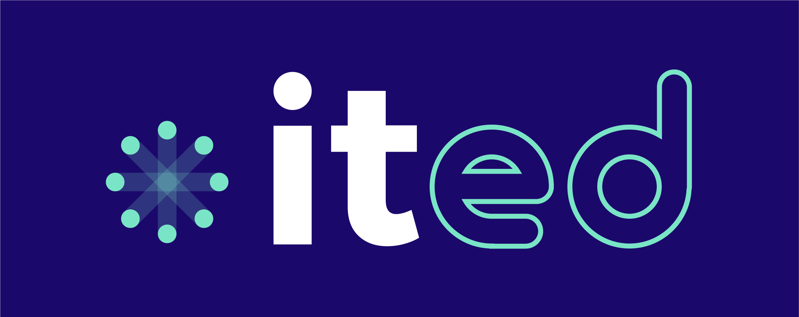

# ITED Solutions - Scripts RMM

Bienvenue sur le dépôt GitHub d'ITED Solutions, dédié à nos scripts de gestion et de surveillance à distance (RMM). Nos scripts sont conçus pour améliorer l'efficacité et la gestion des systèmes informatiques.

## À propos d'ITED Solutions

ited est plus qu’un simple consultant en sécurité informatique ou fournisseur de technologie. Nous sommes un partenaire fiable pour la croissance des PME.  

En tant que fournisseur de services technologiques qui propose aussi des services de conseil, nous ne nous concentrons pas sur un seul fournisseur ou une seule technologie. Nous trouvons ce qui fonctionne le mieux pour votre organisation en tenant compte de vos besoins et objectifs. 

Si vous êtes un responsable de la sécurité des systèmes d’information ou un gestionnaire d’entreprise à la recherche de solutions informatiques ou de cybersécurité, nos experts TI vous accompagneront avec grand plaisir. 

## Scripts RMM

Nos scripts RMM sont développés pour faciliter la gestion à distance des systèmes informatiques. Ils couvrent divers aspects, tels que la maintenance automatisée, la surveillance des performances, et bien plus.

### Fonctionnalités

- **Surveillance à Distance** : [Description]
- **Maintenance Automatisée** : [Description]
- **Gestion des Incidents** : [Description]

## Comment Utiliser

Des templates de scripts ont été mit a votre disposition
- Execution de scripts securisés
- Récupétation de fichiers par API
- Injection et récupération de variables RMM

## Contribution

Nous accueillons les contributions de la communauté! Si vous souhaitez contribuer, veuillez suivre ces directives :

1. **Fork le projet** : Commencez par faire un fork du projet.
2. **Cloner votre fork** : Clonez votre fork sur votre machine locale.
3. **Créer une branche** : Créez une branche pour vos modifications.
4. **Faites vos modifications** : Apportez vos modifications ou ajouts.
5. **Commenter votre code** : Assurez-vous de commenter votre code pour expliquer pourquoi et comment vos modifications améliorent le projet.
6. **Soumettre une Pull Request** : Envoyez une pull request pour que vos modifications soient examinées.

### Recommandations pour les Contributeurs

- **Commentez votre code** : Expliquez clairement ce que fait chaque partie du code pour faciliter la compréhension et la maintenance.
- **Respectez les conventions de codage** : Utilisez un style cohérent pour faciliter la lecture et la compréhension du code par d'autres.
- **Testez vos modifications** : Avant de soumettre une pull request, testez vos changements pour vous assurer qu'ils fonctionnent comme prévu.
- **Documentez les nouvelles fonctionnalités** : Si vous ajoutez de nouvelles fonctionnalités, assurez-vous de mettre à jour la documentation.

## Licence

Licence ITED Solutions pour Scripts RMM

© [2024] ITED Solutions. Tous droits réservés.

L'utilisation, la copie, la modification, la fusion, la publication, la distribution, la sous-licence, et/ou la vente de copies des logiciels fournis dans ce dépôt sont interdites sauf accord explicite de ITED Solutions.

Ce logiciel est fourni par ITED Solutions "en l'état" et toute garantie explicite ou implicite, y compris, mais sans s'y limiter, les garanties implicites de commercialisation et d'adéquation à un usage particulier sont exclues. En aucun cas, les auteurs ou les titulaires du copyright ne seront tenus responsables de tout dommage découlant de ou en relation avec l'utilisation ou la performance de ce logiciel.

## Contact

Pour toute question ou suggestion, n'hésitez pas à nous contacter à mabrochu@it-ed.com
